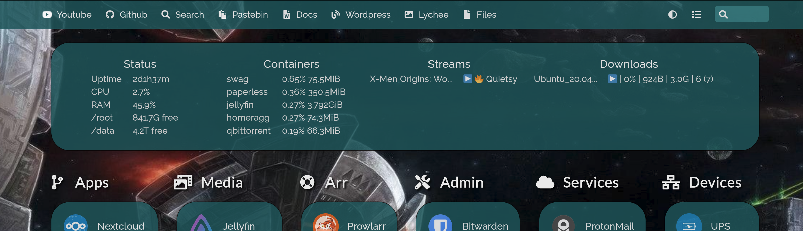

# Homer Status

A container that integrates with Homer's message section and displays information such as system stats, container stats, streams and downloads.



## Compose

```Yaml
  homerstatus:
    image: ghcr.io/quietsy/homer-status
    container_name: homerstatus
    environment:
      - DISKS=/root,/data #optional
      - JELLYFIN=http://jellyfin:8096/sessions?api_key=SOME_KEY #optional
      - QBITTORRENT=user:password@qbittorrent:8080 #optional
    volumes:
      - /path/to/config:/config
      - /path/to/additional/disk/folder:/data #optional
    ports:
    - 5000:5000
    restart: always
```

## Parameters

| Parameter | Function |
| :----: | --- |
| `DISKS` | Add additional disks to be displayed by mounting any folder inside them under volumes, and listing the mounts here. |
| `JELLYFIN` | Display Jellyfin streams, replace `SOME_KEY` with an API key. |
| `QBITTORRENT` | Display qBittorrent downloads, replace `user:password`. |

### Docker Containers
Enable displaying docker container stats by adding the following to the crontab on the host:
```
* * * * * /path/to/config/stats.sh
```

## Homer Configuration

Add the following to Homer's `config.yml`, replace `<server-ip>`.
```Yaml
stylesheet:
  - "assets/custom.css"
message:
  url: https://<server-ip>:5000/
  content: "Status could not be loaded"
  refreshInterval: 5000
```
Add the following to Homer's `custom.css`, adjust according to your design:
```CSS
@charset "UTF-8";

body #main-section .message{
  margin: 5px;
  border-radius: 35px;
}
body #main-section .message{
  border-style: solid;
  border-width: 1px;
  border-color: black; 
  opacity: .85;
  font-weight: 900;
}
.message-container{
  display: inline-block;
  margin: 5px;
  min-width: 270px;
}
body h3{
  font-family: Raleway,sans-serif;
  text-align: center;
  font-size: 20px;
  font-weight: 900;
  color: white;
}
td { 
  padding-right: 20px;
}
table { 
  margin-left: auto;
  margin-right: auto;
}
```